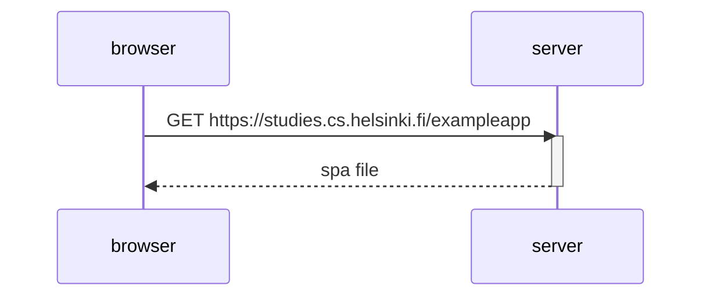

```mermaid
sequenceDiagram
    participant browser
    participant server

    browser->>server: GET https://studies.cs.helsinki.fi/exampleapp
    activate server
    server-->>browser: spa file
    deactivate server

    %% It only reloads the spa file to get changes


```
